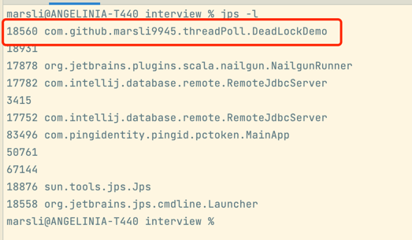

# 死锁的排查
## 1、jps -l
### 找到死锁的进程号


## 2、jstack <进程号>
### 查看故障报告
```db2
2022-04-27 15:23:28
Full thread dump OpenJDK 64-Bit Server VM (25.252-b09 mixed mode):

"Attach Listener" #14 daemon prio=9 os_prio=31 tid=0x00007f88db80e000 nid=0xa803 waiting on condition [0x0000000000000000]
   java.lang.Thread.State: RUNNABLE

"DestroyJavaVM" #13 prio=5 os_prio=31 tid=0x00007f88dc82e000 nid=0xb03 waiting on condition [0x0000000000000000]
   java.lang.Thread.State: RUNNABLE

"ThreadBBB" #12 prio=5 os_prio=31 tid=0x00007f88dc82c800 nid=0xa903 waiting for monitor entry [0x0000700002e7d000]
   java.lang.Thread.State: BLOCKED (on object monitor)
        at com.github.marsli9945.threadPoll.HoldLockThread.run(DeadLockDemo.java:36)
        - waiting to lock <0x000000076ac76758> (a java.lang.String)
        - locked <0x000000076ac76790> (a java.lang.String)
        at java.lang.Thread.run(Thread.java:748)

"ThreadAAA" #11 prio=5 os_prio=31 tid=0x00007f88db041800 nid=0x5503 waiting for monitor entry [0x0000700002d7a000]
   java.lang.Thread.State: BLOCKED (on object monitor)
        at com.github.marsli9945.threadPoll.HoldLockThread.run(DeadLockDemo.java:36)
        - waiting to lock <0x000000076ac76790> (a java.lang.String)
        - locked <0x000000076ac76758> (a java.lang.String)
        at java.lang.Thread.run(Thread.java:748)

"Service Thread" #10 daemon prio=9 os_prio=31 tid=0x00007f88da81e800 nid=0x4303 runnable [0x0000000000000000]
   java.lang.Thread.State: RUNNABLE

"C1 CompilerThread3" #9 daemon prio=9 os_prio=31 tid=0x00007f88d8808800 nid=0x3f03 waiting on condition [0x0000000000000000]
   java.lang.Thread.State: RUNNABLE

"C2 CompilerThread2" #8 daemon prio=9 os_prio=31 tid=0x00007f88dd05b800 nid=0x3e03 waiting on condition [0x0000000000000000]
   java.lang.Thread.State: RUNNABLE

"C2 CompilerThread1" #7 daemon prio=9 os_prio=31 tid=0x00007f88db042800 nid=0x3d03 waiting on condition [0x0000000000000000]
   java.lang.Thread.State: RUNNABLE

"C2 CompilerThread0" #6 daemon prio=9 os_prio=31 tid=0x00007f88d903c800 nid=0x4703 waiting on condition [0x0000000000000000]
   java.lang.Thread.State: RUNNABLE

"Monitor Ctrl-Break" #5 daemon prio=5 os_prio=31 tid=0x00007f88dd012800 nid=0x4803 runnable [0x0000700002665000]
   java.lang.Thread.State: RUNNABLE
        at java.net.SocketInputStream.socketRead0(Native Method)
        at java.net.SocketInputStream.socketRead(SocketInputStream.java:116)
        at java.net.SocketInputStream.read(SocketInputStream.java:171)
        at java.net.SocketInputStream.read(SocketInputStream.java:141)
        at sun.nio.cs.StreamDecoder.readBytes(StreamDecoder.java:284)
        at sun.nio.cs.StreamDecoder.implRead(StreamDecoder.java:326)
        at sun.nio.cs.StreamDecoder.read(StreamDecoder.java:178)
        - locked <0x000000076adc37a8> (a java.io.InputStreamReader)
        at java.io.InputStreamReader.read(InputStreamReader.java:184)
        at java.io.BufferedReader.fill(BufferedReader.java:161)
        at java.io.BufferedReader.readLine(BufferedReader.java:324)
        - locked <0x000000076adc37a8> (a java.io.InputStreamReader)
        at java.io.BufferedReader.readLine(BufferedReader.java:389)
        at com.intellij.rt.execution.application.AppMainV2$1.run(AppMainV2.java:49)

"Signal Dispatcher" #4 daemon prio=9 os_prio=31 tid=0x00007f88da81c800 nid=0x3903 runnable [0x0000000000000000]
   java.lang.Thread.State: RUNNABLE

"Finalizer" #3 daemon prio=8 os_prio=31 tid=0x00007f88da011000 nid=0x4e03 in Object.wait() [0x0000700002359000]
   java.lang.Thread.State: WAITING (on object monitor)
        at java.lang.Object.wait(Native Method)
        - waiting on <0x000000076ab09508> (a java.lang.ref.ReferenceQueue$Lock)
        at java.lang.ref.ReferenceQueue.remove(ReferenceQueue.java:144)
        - locked <0x000000076ab09508> (a java.lang.ref.ReferenceQueue$Lock)
        at java.lang.ref.ReferenceQueue.remove(ReferenceQueue.java:165)
        at java.lang.ref.Finalizer$FinalizerThread.run(Finalizer.java:216)

"Reference Handler" #2 daemon prio=10 os_prio=31 tid=0x00007f88db811000 nid=0x3103 in Object.wait() [0x0000700002256000]
   java.lang.Thread.State: WAITING (on object monitor)
        at java.lang.Object.wait(Native Method)
        - waiting on <0x000000076ab07118> (a java.lang.ref.Reference$Lock)
        at java.lang.Object.wait(Object.java:502)
        at java.lang.ref.Reference.tryHandlePending(Reference.java:191)
        - locked <0x000000076ab07118> (a java.lang.ref.Reference$Lock)
        at java.lang.ref.Reference$ReferenceHandler.run(Reference.java:153)

"VM Thread" os_prio=31 tid=0x00007f88db010800 nid=0x5103 runnable 

"GC task thread#0 (ParallelGC)" os_prio=31 tid=0x00007f88d9008800 nid=0x2107 runnable 

"GC task thread#1 (ParallelGC)" os_prio=31 tid=0x00007f88d900c800 nid=0x2303 runnable 

"GC task thread#2 (ParallelGC)" os_prio=31 tid=0x00007f88d9010000 nid=0x2503 runnable 

"GC task thread#3 (ParallelGC)" os_prio=31 tid=0x00007f88d9010800 nid=0x2a03 runnable 

"GC task thread#4 (ParallelGC)" os_prio=31 tid=0x00007f88d9011000 nid=0x2c03 runnable 

"GC task thread#5 (ParallelGC)" os_prio=31 tid=0x00007f88d9012000 nid=0x2d03 runnable 

"GC task thread#6 (ParallelGC)" os_prio=31 tid=0x00007f88d9012800 nid=0x5303 runnable 

"GC task thread#7 (ParallelGC)" os_prio=31 tid=0x00007f88d9013000 nid=0x2f03 runnable 

"VM Periodic Task Thread" os_prio=31 tid=0x00007f88db01a000 nid=0x4203 waiting on condition 

JNI global references: 15


Found one Java-level deadlock:
=============================
"ThreadBBB":
  waiting to lock monitor 0x00007f88d90164b8 (object 0x000000076ac76758, a java.lang.String),
  which is held by "ThreadAAA"
"ThreadAAA":
  waiting to lock monitor 0x00007f88d9018ea8 (object 0x000000076ac76790, a java.lang.String),
  which is held by "ThreadBBB"

# 看这里，故障报告，堆栈信息
Java stack information for the threads listed above:
===================================================
"ThreadBBB":
        at com.github.marsli9945.threadPoll.HoldLockThread.run(DeadLockDemo.java:36)
        - waiting to lock <0x000000076ac76758> (a java.lang.String)
        - locked <0x000000076ac76790> (a java.lang.String)
        at java.lang.Thread.run(Thread.java:748)
"ThreadAAA":
        at com.github.marsli9945.threadPoll.HoldLockThread.run(DeadLockDemo.java:36)
        - waiting to lock <0x000000076ac76790> (a java.lang.String)
        - locked <0x000000076ac76758> (a java.lang.String)
        at java.lang.Thread.run(Thread.java:748)

Found 1 deadlock.
```