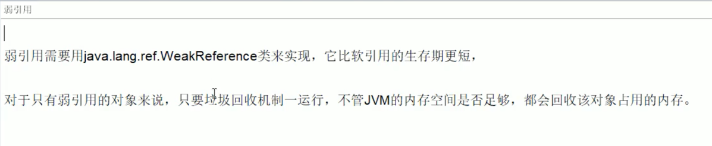

# JVM调优

### GC 问题列表


### JVM参数类型
#### 标配参数
- -version
- -help
- -java -showversion
#### x参数(了解)
- -Xint 解释执行
- -Xcomp 第一次使用就编译成本地代码
- -Xmixed 混合模式
#### XX参数(重点)
##### Boolean类型
###### 公式
- -XX:+或者-某个属性值
- +表示开启
- -表示关闭
 
###### Case
- 是否打印GC收集细节 -XX:-PrintGCDetails 关闭
- 是否使用串行垃圾回收器 -XX:+PrintGCDetails 开启

##### kv设置类型
###### 公式
- -XX:属性key=属性值value

###### Case
- -XX:MetaspaceSize=128m
- -XX:MaxTenuringThreshold=15

##### jinfo可查看当前运行程序的配置
###### 公式
- jinfo -flag 配置项 进程号 (查看指定配置项)
- jinfo -flags 进程号 (查看所有配置项)
 
##### 注意
- -Xms 等价于-XX:InitialHeapSize 初始堆内存
- -Xmx 等价于-XX:MaxHeapSize 最大堆内存

### 查看JVM默认值
#### -XX:+PrintFlagsInitial
##### 主要查看初始默认
##### 公式
- java -XX:+PrintFlagsInitial -version
- java -XX:+PrintFlagsInitial
##### Case

#### -XX:+PrintFlagsFinal
##### 主要查看修改更新
- = 初始值
- := 修改后的值
##### 公式
- java -XX:+PrintFlagsFinal -version
- java -XX:+PrintFlagsFinal
##### Case
#### PrintFlagsFinal举例，运行java命令同时打印参数
> java -XX:+PrintFlagsFinal -Xss 128k T

#### -XX:+PrintCommandLineFlags 打印命令行参数
##### 主要查看垃圾回收器，UseParallelGC为jdk8默认使用的并行垃圾回收器
```
marsli@ANGELINIA-T440 interview % java -XX:+PrintCommandLineFlags -version
-XX:InitialHeapSize=268435456 -XX:MaxHeapSize=4294967296 -XX:+PrintCommandLineFlags -XX:+UseCompressedClassPointers -XX:+UseCompressedOops -XX:+UseParallelGC 
openjdk version "1.8.0_252"
OpenJDK Runtime Environment Corretto-8.252.09.1 (build 1.8.0_252-b09)
OpenJDK 64-Bit Server VM Corretto-8.252.09.1 (build 25.252-b09, mixed mode)
```
### JVM常用基本参数
#### -Xms 初始内存大小，默认为物理内存1/64,等价于-XX:InitialHeapSize
#### -Xmx 最大分配内存，默认为物理内存1/4,等价于-XX:MaxHeapSize
#### -Xss 设置单个线程栈的大小，一般默认为512k~1024k，等价于-XX:ThreadStackSize
#### -Xmn 这只年轻代大小
#### -XX:MetaspaceSize 设置元空间大小
> 元空间的本质和永久代类似，都是jvm规范中方法区的实现
> 
> 不过元空间与永久代最大的区别在于：
> 
> 元空间并不在虚拟机中，而是使用本地内存
> 
> 因此，默认情况下，元空间的大小仅受本地内存限制
- 典型设置案例
#### -XX:+PrintGCDetails 输出GC的详细信息
```
[GC (Allocation Failure) [PSYoungGen: 1734K->496K(2560K)] 1734K->576K(9728K), 0.0044808 secs] [Times: user=0.01 sys=0.01, real=0.00 secs] 
[GC (Allocation Failure) [PSYoungGen: 496K->432K(2560K)] 576K->512K(9728K), 0.0021589 secs] [Times: user=0.01 sys=0.00, real=0.01 secs] 
[Full GC (Allocation Failure) [PSYoungGen: 432K->0K(2560K)] [ParOldGen: 80K->463K(7168K)] 512K->463K(9728K), [Metaspace: 3157K->3157K(1056768K)], 0.0061882 secs] [Times: user=0.01 sys=0.00, real=0.00 secs] 
[GC (Allocation Failure) [PSYoungGen: 0K->0K(2560K)] 463K->463K(9728K), 0.0009967 secs] [Times: user=0.01 sys=0.00, real=0.00 secs] 
[Full GC (Allocation Failure) [PSYoungGen: 0K->0K(2560K)] [ParOldGen: 463K->446K(7168K)] 463K->446K(9728K), [Metaspace: 3157K->3157K(1056768K)], 0.0059482 secs] [Times: user=0.02 sys=0.00, real=0.01 secs] 
Heap
 PSYoungGen      total 2560K, used 122K [0x00000007bfd00000, 0x00000007c0000000, 0x00000007c0000000)
  eden space 2048K, 5% used [0x00000007bfd00000,0x00000007bfd1e920,0x00000007bff00000)
  from space 512K, 0% used [0x00000007bff00000,0x00000007bff00000,0x00000007bff80000)
  to   space 512K, 0% used [0x00000007bff80000,0x00000007bff80000,0x00000007c0000000)
 ParOldGen       total 7168K, used 446K [0x00000007bf600000, 0x00000007bfd00000, 0x00000007bfd00000)
  object space 7168K, 6% used [0x00000007bf600000,0x00000007bf66f940,0x00000007bfd00000)
 Metaspace       used 3211K, capacity 4496K, committed 4864K, reserved 1056768K
  class space    used 344K, capacity 388K, committed 512K, reserved 1048576K
Exception in thread "main" java.lang.OutOfMemoryError: Java heap space
	at com.github.marsli9945.jvm.gc.HelloGc.main(HelloGc.java:16)
```
##### GC

##### Full GC


#### -XX:SurvivorRatio
设置新生代中eden和s0/s1空间比例<br/>
默认<br/>
-XX:SurvivorRatio=8, Eden:s0:s1=8:1:1<br/>
假如<br/>
-XX:SurvivorRatio=4, Eden:s0:s1=4:1:1<br/>
SurvivorRatio的值就是设置eden区的比例占多少，s0/s1相同
#### -XX:NewRatio
配置新生代和老年代在堆结构中的占比<br/>
默认<br/>
-XX:NewRatio=2，新生代占1老年代占2，年轻代占整个堆的1/3<br/>
假如<br/>
-XX:NewRatio=4，新生代占1老年代占4，年轻代占整个堆的1/5<br/>
NewRatio值就是设置老年代的占比，剩下的1给新生代
#### -XX:MaxTenuringThreshold
设置垃圾的最大年龄<br/>
默认值为15，可设置值为0到15之间<br/>
一般使用默认不会调整

### 垃圾回收器
- -XX:+UseParallelGC 并行垃圾回收器，jdk8默认使用
- -XX:+UseSerialGC 串行垃圾回收器

### 强引用、软引用、弱引用、虚引用
> java提供了四种引用类型，在垃圾回收的时候，都有自己各自的特点。<br/>
> ReferenceQueue是用来配合引用工作的，没有ReferenceQueue一样可以运行。
> 
> 创建引用的时候可以指定关联队列，当GC释放对象内存的时候，会将引用加入到引用队列，<br/>
> 如果程序发现某个虚引用已经加入到引用队列，那么就可以在所引用对象的内存回收之前才去必要的行动，<br/>
> 这相当于是一种通知机制
> 
> 当关联的引用队列中有数据的时候，意味着引用指向的堆内存中的对象被回收。<br/>
> 通过这种方式，JVM允许我们在对象销毁后，做一些我们想做的事。
#### 整体架构

#### 强引用(默认支持)

#### 软引用

#### 弱引用

#### 实际应用

#### 虚引用

##### 引用队列


### GCRoot和四大引用小总结


### 错误/异常


### OOM的认识
#### java.Lang.StackOverFlowError
方法调用过深，导致栈内存溢出
#### java.Lang.OutOfMemoryError: java heap space
对象创建太多，导致堆内存溢出
#### java.Lang.OutOfMemoryError: GC overhead limit exceeded

#### java.Lang.OutOfMemoryError: Direct buffer memory(NIO)

#### java.Lang.OutOfMemoryError: unable to create new native thread

##### linux中查看用户的线程上限
> vim /etc/security/limits.d/90-nproc.conf
#### java.Lang.OutOfMemoryError: Metaspace


### GC垃圾回收算法和垃圾收集器的关系
#### GC算法(引用计数/复制/标清/标整)是内存回收的方法伦，垃圾收集器是算法落地实现
#### 因为目前位置还没有完美的收集器出现，更加没有万能的收集器，只是针对具体应用最合适的收集器，进行分代收集
#### 四种主要垃圾回收器

