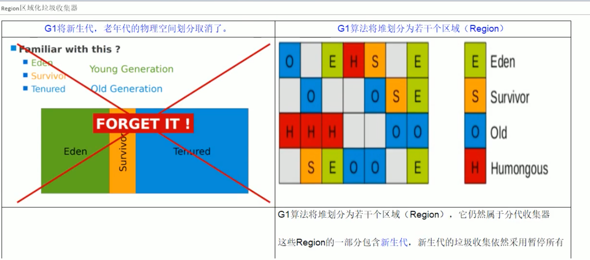

# JVM调优

### GC 问题列表


### JVM参数类型
#### 标配参数
- -version
- -help
- -java -showversion
#### x参数(了解)
- -Xint 解释执行
- -Xcomp 第一次使用就编译成本地代码
- -Xmixed 混合模式
#### XX参数(重点)
##### Boolean类型
###### 公式
- -XX:+或者-某个属性值
- +表示开启
- -表示关闭
 
###### Case
- 是否打印GC收集细节 -XX:-PrintGCDetails 关闭
- 是否使用串行垃圾回收器 -XX:+PrintGCDetails 开启

##### kv设置类型
###### 公式
- -XX:属性key=属性值value

###### Case
- -XX:MetaspaceSize=128m
- -XX:MaxTenuringThreshold=15

##### jinfo可查看当前运行程序的配置
###### 公式
- jinfo -flag 配置项 进程号 (查看指定配置项)
- jinfo -flags 进程号 (查看所有配置项)
 
##### 注意
- -Xms 等价于-XX:InitialHeapSize 初始堆内存
- -Xmx 等价于-XX:MaxHeapSize 最大堆内存

### 查看JVM默认值
#### -XX:+PrintFlagsInitial
##### 主要查看初始默认
##### 公式
- java -XX:+PrintFlagsInitial -version
- java -XX:+PrintFlagsInitial
##### Case

#### -XX:+PrintFlagsFinal
##### 主要查看修改更新
- = 初始值
- := 修改后的值
##### 公式
- java -XX:+PrintFlagsFinal -version
- java -XX:+PrintFlagsFinal
##### Case
#### PrintFlagsFinal举例，运行java命令同时打印参数
> java -XX:+PrintFlagsFinal -Xss 128k T

#### -XX:+PrintCommandLineFlags 打印命令行参数
##### 主要查看垃圾回收器，UseParallelGC为jdk8默认使用的并行垃圾回收器
```
marsli@ANGELINIA-T440 interview % java -XX:+PrintCommandLineFlags -version
-XX:InitialHeapSize=268435456 -XX:MaxHeapSize=4294967296 -XX:+PrintCommandLineFlags -XX:+UseCompressedClassPointers -XX:+UseCompressedOops -XX:+UseParallelGC 
openjdk version "1.8.0_252"
OpenJDK Runtime Environment Corretto-8.252.09.1 (build 1.8.0_252-b09)
OpenJDK 64-Bit Server VM Corretto-8.252.09.1 (build 25.252-b09, mixed mode)
```
### JVM常用基本参数
#### -Xms 初始内存大小，默认为物理内存1/64,等价于-XX:InitialHeapSize
#### -Xmx 最大分配内存，默认为物理内存1/4,等价于-XX:MaxHeapSize
#### -Xss 设置单个线程栈的大小，一般默认为512k~1024k，等价于-XX:ThreadStackSize
#### -Xmn 这只年轻代大小
#### -XX:MetaspaceSize 设置元空间大小
> 元空间的本质和永久代类似，都是jvm规范中方法区的实现
> 
> 不过元空间与永久代最大的区别在于：
> 
> 元空间并不在虚拟机中，而是使用本地内存
> 
> 因此，默认情况下，元空间的大小仅受本地内存限制
- 典型设置案例
#### -XX:+PrintGCDetails 输出GC的详细信息
```
[GC (Allocation Failure) [PSYoungGen: 1734K->496K(2560K)] 1734K->576K(9728K), 0.0044808 secs] [Times: user=0.01 sys=0.01, real=0.00 secs] 
[GC (Allocation Failure) [PSYoungGen: 496K->432K(2560K)] 576K->512K(9728K), 0.0021589 secs] [Times: user=0.01 sys=0.00, real=0.01 secs] 
[Full GC (Allocation Failure) [PSYoungGen: 432K->0K(2560K)] [ParOldGen: 80K->463K(7168K)] 512K->463K(9728K), [Metaspace: 3157K->3157K(1056768K)], 0.0061882 secs] [Times: user=0.01 sys=0.00, real=0.00 secs] 
[GC (Allocation Failure) [PSYoungGen: 0K->0K(2560K)] 463K->463K(9728K), 0.0009967 secs] [Times: user=0.01 sys=0.00, real=0.00 secs] 
[Full GC (Allocation Failure) [PSYoungGen: 0K->0K(2560K)] [ParOldGen: 463K->446K(7168K)] 463K->446K(9728K), [Metaspace: 3157K->3157K(1056768K)], 0.0059482 secs] [Times: user=0.02 sys=0.00, real=0.01 secs] 
Heap
 PSYoungGen      total 2560K, used 122K [0x00000007bfd00000, 0x00000007c0000000, 0x00000007c0000000)
  eden space 2048K, 5% used [0x00000007bfd00000,0x00000007bfd1e920,0x00000007bff00000)
  from space 512K, 0% used [0x00000007bff00000,0x00000007bff00000,0x00000007bff80000)
  to   space 512K, 0% used [0x00000007bff80000,0x00000007bff80000,0x00000007c0000000)
 ParOldGen       total 7168K, used 446K [0x00000007bf600000, 0x00000007bfd00000, 0x00000007bfd00000)
  object space 7168K, 6% used [0x00000007bf600000,0x00000007bf66f940,0x00000007bfd00000)
 Metaspace       used 3211K, capacity 4496K, committed 4864K, reserved 1056768K
  class space    used 344K, capacity 388K, committed 512K, reserved 1048576K
Exception in thread "main" java.lang.OutOfMemoryError: Java heap space
	at com.github.marsli9945.jvm.gc.HelloGc.main(HelloGc.java:16)
```
##### GC

##### Full GC


#### -XX:SurvivorRatio
设置新生代中eden和s0/s1空间比例<br/>
默认<br/>
-XX:SurvivorRatio=8, Eden:s0:s1=8:1:1<br/>
假如<br/>
-XX:SurvivorRatio=4, Eden:s0:s1=4:1:1<br/>
SurvivorRatio的值就是设置eden区的比例占多少，s0/s1相同
#### -XX:NewRatio
配置新生代和老年代在堆结构中的占比<br/>
默认<br/>
-XX:NewRatio=2，新生代占1老年代占2，年轻代占整个堆的1/3<br/>
假如<br/>
-XX:NewRatio=4，新生代占1老年代占4，年轻代占整个堆的1/5<br/>
NewRatio值就是设置老年代的占比，剩下的1给新生代
#### -XX:MaxTenuringThreshold
设置垃圾的最大年龄<br/>
默认值为15，可设置值为0到15之间<br/>
一般使用默认不会调整

### 强引用、软引用、弱引用、虚引用
> java提供了四种引用类型，在垃圾回收的时候，都有自己各自的特点。<br/>
> ReferenceQueue是用来配合引用工作的，没有ReferenceQueue一样可以运行。
> 
> 创建引用的时候可以指定关联队列，当GC释放对象内存的时候，会将引用加入到引用队列，<br/>
> 如果程序发现某个虚引用已经加入到引用队列，那么就可以在所引用对象的内存回收之前才去必要的行动，<br/>
> 这相当于是一种通知机制
> 
> 当关联的引用队列中有数据的时候，意味着引用指向的堆内存中的对象被回收。<br/>
> 通过这种方式，JVM允许我们在对象销毁后，做一些我们想做的事。
#### 整体架构

#### 强引用(默认支持)

#### 软引用

#### 弱引用

#### 实际应用

#### 虚引用

##### 引用队列


### GCRoot和四大引用小总结


### 错误/异常


### OOM的认识
#### java.Lang.StackOverFlowError
方法调用过深，导致栈内存溢出
#### java.Lang.OutOfMemoryError: java heap space
对象创建太多，导致堆内存溢出
#### java.Lang.OutOfMemoryError: GC overhead limit exceeded

#### java.Lang.OutOfMemoryError: Direct buffer memory(NIO)

#### java.Lang.OutOfMemoryError: unable to create new native thread

##### linux中查看用户的线程上限
> vim /etc/security/limits.d/90-nproc.conf
#### java.Lang.OutOfMemoryError: Metaspace


### GC垃圾回收算法和垃圾收集器的关系
#### GC算法(引用计数/复制/标清/标整)是内存回收的方法伦，垃圾收集器是算法落地实现
#### 因为目前位置还没有完美的收集器出现，更加没有万能的收集器，只是针对具体应用最合适的收集器，进行分代收集
#### 四种主要垃圾回收器

##### 串行垃圾回收器(Serial) 
> -XX:+UseSerialGC <br/>
> -XX:+UseSerialOldGC(废弃) <br/>
> 它为单线程环境设计且只使用一个线程进行垃圾回收，会暂停所有用户线程。所以不适合服务器环境
##### 并行垃圾回收器(Parallel) 
> -XX:+UseParallelGC <br/>
> -XX:+UseParallelOldGC <br/>
> 多个垃圾收集线程并行工作，此时用户线程是暂停的，适用于科学计算/大数据处理首台处理等弱交互场景
##### 并发垃圾回收器(CMS) 
> -XX:+UseConcMarkSweepGC <br/>
> -XX:+UseParNewGC <br/>
> 用户线程和垃圾回收线程同时执行(不一定是并行，可能是交替执行)，不需要停顿用户线程<br/>
> 互联网公司多用它，使用对响应时间有要求的场景
##### 上面3个小总结

##### G1垃圾回收器(Serial)
> -XX:+UseG1GC <br/>
> G1垃圾回收器将堆内存分割成不同的区域，然后并发的对其进行垃圾回收
##### GC算法整体概述


### 如何查看jvm默认的垃圾回收器
> java -XX:+PrintCommandLineFlags -version
### 垃圾收集器有哪些


#### 部分参数预先说明
- DefNew: Default New Generation 新生代默认的垃圾回收器
- Tenured: Old 老年代使用串行垃圾回收
- ParNew: Parallel New Generation 新生代用并行回收器，老年代用串行
- PSYoungGen: Parallel Scavenge 在年轻代使用并行垃圾回收器
- ParOldGen: Parallel Old Generation 在老年代用并行垃圾回收器

#### Server/Client模式分别什么意思


#### 新生代
##### 串行GC(Serial/Serial Copying)


##### 并行GC(ParNew)


##### 并行回收GC(Parallel/Parallel Scavenge)


#### 老年代
##### 串行GC(Serial/Serial Copying)

##### 并行GC(Parallel Old)

##### 并发标记清除GC(CMS)


###### 四步过程

- 初始标记(CMS initial mark) 
> 只是标记一下GCRoot能直接关联的对象，速度很快，仍然需要暂停所有工作线程。
- 并发标记(CMS concurrent mark) 
>进行GCRoot跟踪的过程，和用户线程一起工作，不需要暂停工作线程。主要标记过程，标记全部对象。
- 重新标记(CMS remark)
> 为了修正并发标记期间，因用户线程继续运行导致标记发生变动的部分对象的标记记录，仍然需要暂停所有工作线程。<br/>
> 由于并发标记时，用户线程依然运行，因此在正式清理前，再做修正。
- 并发清除(CMS concurrent sweep)和用户线程一起
> 清除GCRoot不可达对象，和用户线程一起工作，不需要暂停工作线程。基于标记结果，直接清理对象<br/>
> 由于耗时最长的并发标记和并发清除过程中，垃圾收集线程可以和工作线程一起并发工作，<br/>
> 所以从总体上看，CMS收集器的内存回收和用户线程是一起并发执行的。
###### 优缺点
####### 优点
- 并发收集低停顿
####### 缺点
- 并发执行对CPU资源压力大
- 采用标记清除算法会产生大量碎片
#### 如何选择垃圾收集器


### G1垃圾收集器
#### 以前收集器的特点
- 年轻代和老年代是各自独立且连续的内存块
- 年轻代收集使用单eden+s0+s1进行复制算法
- 老年代收集必须扫描整个老年代区域
- 都是以尽可能少而快速的执行GC为设计原则
#### G1是什么


#### G1的特点

#### 底层原理
##### Region区域化垃圾收集器
最大的好处是化整为零，避免全内存扫描，只需要按照区域来扫描即可。



##### 回收步骤

##### 4步过程

##### 常用配置参数

- -XX:+UseG1GC 开启G1垃圾收集器
- -XX:G1HeapRegionSize=n 设置G1区域的大小。值是2的幂，范围是1MB到32MB。
- -XX:MaxGCPauseMillis=n 最大GC停顿时间，这个是软目标，JVM将尽可能(但不保证)停顿小于这个时间。
- -XX:InitiatingHeapOccupancyPercent=n 堆栈用了多少的时候触发GC，默认是45
- -XX:ConcGCThreads=n 并发GC使用的线程数
- -XX:G1ResevePercent=n 设置作为空闲空间的预留内存百分比，以降低目标空间溢出的风险，默认是10%
#### G1和CMS比的优势


### springBoot


### 生产环境服务变慢，诊断思路和性能评估
#### 整机：top

> load average: 0.04, 0.19, 0.17<br/>
> 代表系统1分钟、5分钟、15分钟的平均负载<br/>
> 如果 (v1+v2+v3)/3 > 0.6 代表系统压力重<br/>
> 按s查看cpu具体核负载<br/>
> uptime 是 top 的精简版
#### CPU：vmstat
> vmstat -n 2 3<br/>
> 每2秒采样一次，共采样3次


##### 额外
> mpstat -P ALL 2 查看所有核心的信息<br/>
> pidstat -u 1 -p <进程号> 每个进程使用cpu的用量分解信息
#### 内存：free
- free 单位字节
- free -g 单位G
- free -m 单位M，首选

##### 额外
> pidstat -p <进程号> -r <采样间隔秒数> 每个进程使用内存的用量分解信息
#### 硬盘：df
- df -h
#### 磁盘IO：iostat


##### 额外
> pidstat -p <进程号> -d <采样间隔秒数> 每个进程使用磁盘IO的用量分解信息
#### 网络IO：ifstat


### 生产环境CPU占用过高，解决的分析思路和定位


#### 定位线程


