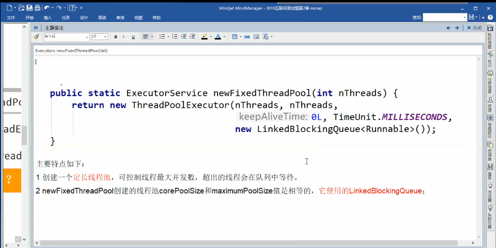
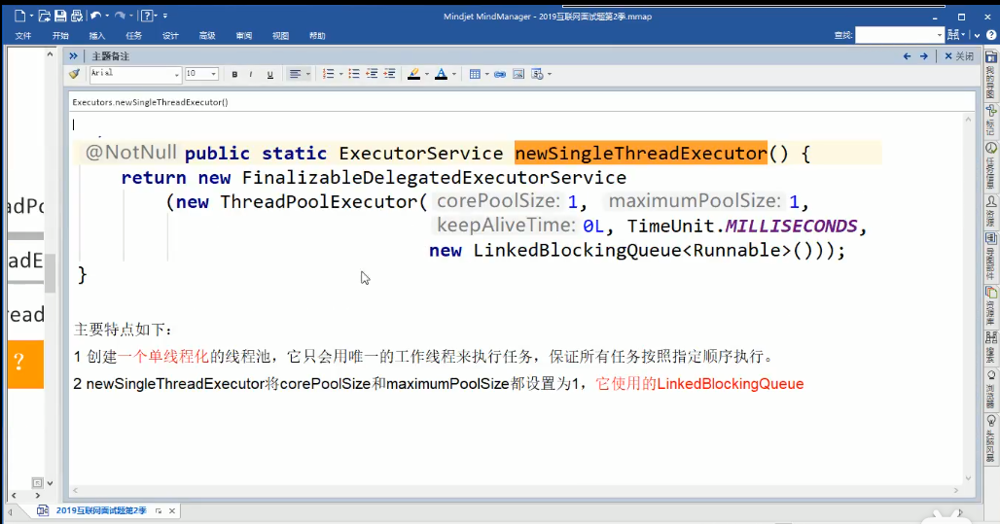
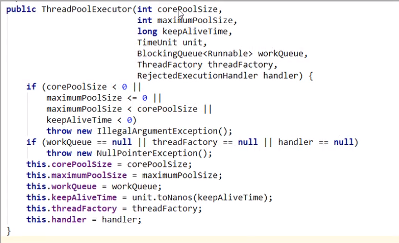
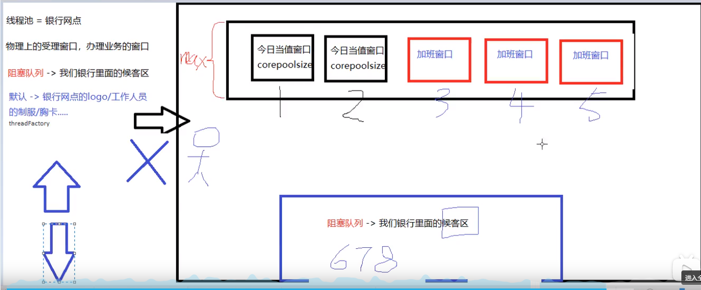
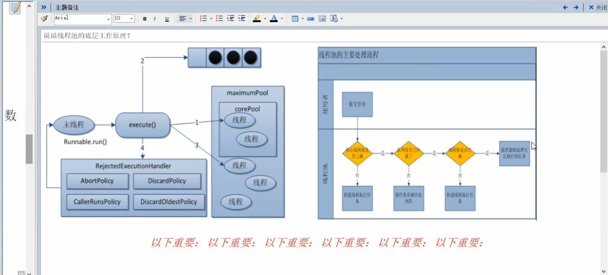
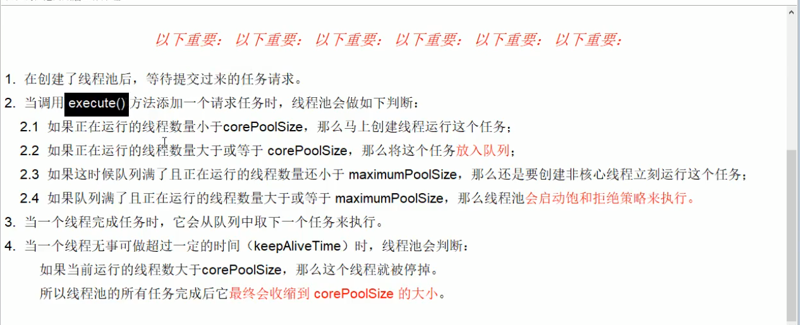
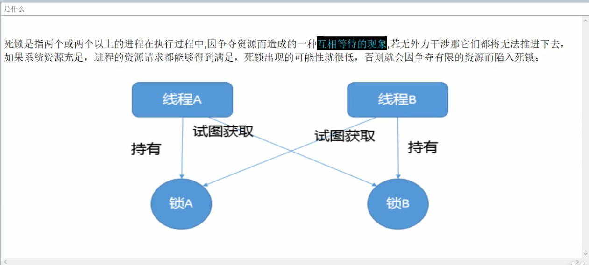

# 线程池

线程池做的工作主要是控制运行的线程数量，处理过程中将任务放入队列，然后在线程创建后
启动这些任务，如果线程数量超过了最大数量超出数量的线程排队等待，等其他线程执行完毕，
再从队列中取出任务来执行。

他的主要特点为：线程服用；控制对打并发数；管理线程。

第一：降低资源消耗。通过重复利用已创建的线程降低线程创建和销毁造成的消耗。
第二：提高响应速度。当任务到达时，任务可以不需要等待线程创建就能立即执行。
第三：提高线程可管理性。线程是稀缺资源，如果无限制创建，不仅会消耗系统资源，还会降低
系统稳定性，使用线程池可以进行统一分配，调优和监控

#### 线程池的底层：ThreadPollExecutor

#### 三种线程池
##### Executors.newFixedThreadPoll(int) 固定线程数的线程池
执行长期任务，性能好很多

##### Executors.newSingleThreadExecutor() 一池一线程
一个任务一个任务执行的场景

##### Executors.newCacheThreadPoll() 一池多线程
执行很多短期异步的小程序或者负载较轻的服务

#### 两种不常用的线程池
##### Executors.newScheduledTreadPoll() 不常用

##### Executors.newWorkStealingPoll() Java8新出，带调度的线程池

### 线程池的七个重要参数

### 线程池原理

##### 线程池的四种拒绝策略

### 死锁

